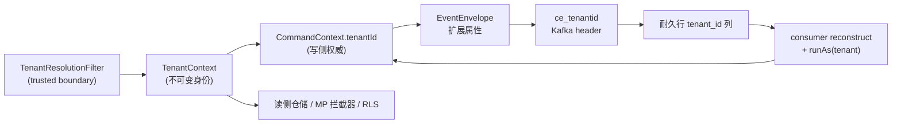

# 原生多租户落地计划

把 [[design-00009-multi-tenancy-tenant-id]] / [[decision-00018-multi-tenancy-boundaries]] / [[spec-00002-multi-tenancy]]
落成代码：pool 判别列 `tenant_id`，租户经**与 decision-00013 同一条传播脊柱**（`CommandContext` → `EventEnvelope` →
`ce_tenantid` header → 耐久行列 → 消费端重建）端到端流动，读侧与基础设施强制按租户隔离；单租户是 N=1 的同一套 schema。

**验收锚点**：一个不依赖业务样例的**双租户** consumer fixture。租户 A、B 各发一条命令，能在
`-jdbc`/`-mybatis-plus` × H2/MySQL/PostgreSQL(RLS) 组合下证明 spec §3 全部 XAC——A 的写入与产出事件带 A、
经 outbox→Kafka(`ce_tenantid`)→消费端仍属 A；以 A 查询绝不可见 B；**RLS 下复用池连接先服务 A 再服务 B 无租户残留**；
`tenancy.enabled=false` 时全落 `__root__` 且行为等价于改造前。当前跑不出即未完成。

**铁律**：
1. `tenant_id` **恒非空**、单一哨兵 `__root__`；`TenantId` 拒绝 `__` 前缀用户租户。**永不产生 NULL 行**（唯一约束陷阱）。
2. 写侧权威是 `CommandContext.tenantId`（显式值，禁 ambient——decision-00012）；`TenantContext` 只在 trusted boundary
   一次写入、请求内不可变、单值，业务代码不得写。
3. 租户只进**租户相对键**（`process_instance.business_key`、web 三键）；**不进**框架生成的全局唯一 id 去重键。
4. **消息管道表不建 RLS**；后台 relay/claim/cleanup 走独立 **BYPASSRLS 角色**跨租户扫。
5. 消费端 `reconstruct` **必须读回** `ce_tenantid`（未知 header 会被静默丢弃）。
6. **可加性**：`enabled=false` 必须与改造前行为等价（回归守护）；`tenant_id` 不用 UUIDv7（低基数、要窄+不可变，命题四）。

## 一、Design

详见 [[design-00009-multi-tenancy-tenant-id]]。落地关键：**这是 decision-00013 传播脊柱的增量**——它已铺好
`CommandContext`↔`EventEnvelope`↔`OutboxMessage`↔`IntegrationEventHeaders` 的 correlation/causation 通道，本计划沿同一
通道再加一个 `tenantId` 字段/属性/header/列。

模块：新增 `aipersimmon-ddd-tenancy`（framework-free）+ `aipersimmon-ddd-tenancy-spring`（装配）；改造既有
cqrs / integration / messaging-kafka / outbox(*) / inbox(*) / process-manager(engine/jdbc/mp) / saga(*) / web-store(*) /
observability / archunit / flyway。

## 二、任务

> 约定：`[tenancy]` 等标模块；「并行」表示与同批无强依赖。每个任务 test-first，含单测；跨库项归 T18。

> **进度**
> - ✅ **T0b**：decision-00013 已补「增补(新增 tenantId)」注记。
> - ✅ **T0（骨架）+ T1（原语）**：新模块 `aipersimmon-ddd-tenancy`（framework-free，仅依赖 core）落地，入 reactor + BOM。
>   `TenantId`（record，≤32、非空校验）、`Tenants`（`ROOT="__root__"` 哨兵 + `of()` 拒 `__` 前缀）、`TenantContext`
>   （ThreadLocal，MDC 式：`current/require/set/clear/runAs`，`set/clear` 标注 trusted-boundary only）、`TenantResolver`
>   + `TenantResolutionContext`（framework-free，`header`/`host`）、`MissingTenantPolicy{REJECT,SYSTEM}`、`MissingTenantException`。
>   **11 单测绿，Spotless/PMD/SpotBugs 全过，`mvn -pl aipersimmon-ddd-tenancy -am verify` BUILD SUCCESS**。
>   `-tenancy-spring` 模块留到 T2（与 T3 一起做，因绑定依赖 CommandContext.tenantId）。
> - ✅ **T3（CommandContext 加 tenantId）**：干净破坏性改。`CommandContext` 4 字段 `(tenantId, messageId,
>   correlationId, causationId)`，tenantId 非空校验；`root(messageId)` 默认 `Tenants.ROOT`（N=1）、新增 `root(tenantId,
>   messageId)`、`deriveChild` 继承 tenant、`of(envelope)` **暂用 ROOT 占位（TODO T4 接 envelope.tenantId()）**。
>   `RegistryCommandBus.send(cmd)` 从 `TenantContext.current()` 播种。cqrs / cqrs-spring 加 tenancy 依赖。更新全部裸
>   `new CommandContext(...)` 调用点：4 处 process 主码 staged-effect/deadline 重建暂传 `Tenants.ROOT.value()`
>   （**TODO T8：从 process 行的 tenant_id 列读**）+ 6 处测试。**全 reactor `mvn install` BUILD SUCCESS——39/39
>   模块全绿、零测试失败**（含 process-manager-jdbc / messaging-kafka / operation-log / outbox / web-store 等
>   Testcontainers 模块 + archunit；cqrs 90/90/90 硬门过、覆盖 98%）。
> - ✅ **T4 + T5（EventEnvelope/OutboxMessage 加 tenantId + Kafka ce_tenantid，一起做）**：`EventEnvelope` 与
>   `OutboxMessage` 各在 subject 后加 `tenantId`（EventEnvelope 必填非空校验）。发布侧 `SpringIntegrationEvents` /
>   `OutboxWriter`(jdbc+mp) 从 `context.tenantId()` 盖章；`InProcessOutboxDispatcher` 从 `message.tenantId()` 重建；
>   `CommandContext.of(envelope)` 改读 `envelope.tenantId()`（去掉 T3 的 ROOT 占位）。messaging-kafka：
>   `IntegrationEventHeaders.TENANT_ID="ce_tenantid"`、`KafkaOutboxDispatcher` 盖章、`KafkaIntegrationEventListener`
>   `reconstruct` 读回（缺 header 回退 ROOT，兼容旧消息）并以 `TenantContext.runAs(...)` 包住下游处理。新增
>   `Tenants.fromValue(...)`（可信重建，不拒 `__` 前缀，供 consumer/relay）。全部 EventEnvelope/OutboxMessage 构造点
>   （8 主码 + 7 测试）更新，新增 EventEnvelope/Kafka 租户断言。**仍留 T6 占位**：`OutboxRelay`(jdbc+mp)、
>   `JdbcDeadLetterStore` 从无列的行重建时用 `Tenants.ROOT.value()`（TODO T6 outbox 加 tenant_id 列）。
>   **全 reactor `mvn install` BUILD SUCCESS——39/39 全绿、零失败**（含 messaging-kafka 租户 header 往返、
>   integration/cqrs 90/90/90 门）。
> - 🔧 **顺带修既有 bug（非租户）**：`operation-log-engine` 的 `spring-context` 是 `test` scope，遮蔽了
>   spring-boot-autoconfigure 传递的 compile scope，干净构建下主代码 `@Bean/@Configuration` 编译失败（stash 基线复现，
>   与租户无关；此前"绿"是 incremental target 残留）。改为 compile scope 解锁 reactor。
> - ✅ **T2（`aipersimmon-ddd-tenancy-spring`）**：新模块入 reactor + BOM。`TenancyProperties`
>   （`aipersimmon.ddd.tenancy.{enabled=false,header=X-Tenant-Id,missing-policy=REJECT}`）、`HeaderTenantResolver`
>   （默认 `TenantResolver`，读 header → `Tenants.of`）、`TenantResolutionFilter`（仿 RequestIdFilter，order
>   `HIGHEST+15`：解析→绑 `TenantContext`+MDC `tenant`→finally 清；缺租户 REJECT→400 / SYSTEM→ROOT；非法值→400）、
>   `TenantContextCommandInterceptor`（order −90，`runAs(ctx.tenantId())` 包住处理——给无环境租户的 relay/batch 兜底）、
>   `AipersimmonDddTenancyAutoConfiguration`（整体 `@ConditionalOnProperty enabled=true`；filter `@ConditionalOnWebApplication`；
>   `imports` 注册）。**9 单测绿**（interceptor 3 / filter 4 mockito / autoconfig 2 WebApplicationContextRunner）+
>   Spotless/PMD/SpotBugs 全过，`-am install` BUILD SUCCESS。`spring-context` 显式 compile（避免 operation-log-engine 那类遮蔽）。
> - ✅ **T6（outbox/dead_letter 加 tenant_id 列，消除 3 处 ROOT 占位）**：三方言 `V3__add_tenant_id.sql`
>   （`ALTER TABLE ... ADD COLUMN tenant_id VARCHAR(64) NOT NULL DEFAULT '__root__'`，outbox + dead_letter；数据列、
>   **不入唯一键**）。jdbc：`OutboxWriter` INSERT、`OutboxRelay` `SELECT_DUE`+`mapRow`、`JdbcDeadLetterStore`
>   `INSERT_DEAD_LETTER`/`SELECT_DEAD_LETTER`/`REQUEUE_OUTBOX` + store/replay 参数全部带上 tenant_id，relay/deadletter
>   改为从行读（去 ROOT 占位、删除 now-unused Tenants import）。mp：`OutboxRecord`/`DeadLetterRecord` 加 `tenantId` 字段
>   +accessor（camelCase→snake_case 自动映射；`selectDue` 用 `SELECT o.*` 自动含列）、`OutboxWriter` setTenantId、
>   `OutboxRelay` toMessage 读列、`MybatisDeadLetterStore` store/replay setTenantId。**T4 的 3 处 T6 占位全部消除**。
>   测试 schema-init 同步加 V3：`outbox-jdbc`/`outbox-mybatis-plus` 的 `application.properties`（`spring.sql.init`）、
>   `ConnectedTraceEndToEndTest`（`EmbeddedDatabaseBuilder.addScript`）。mp 双孪生实体的 boilerplate accessor 加
>   `// CPD-OFF`（新增 tenantId accessor 触发 CPD 重复阈值）。**全 reactor `mvn install` BUILD SUCCESS——40/40 全绿零失败**
>   （含三方言迁移 + relay 往返 + Kafka ce_tenantid + 90/90/90 门）。过程中 `OutboxRelayBackoffTest` 一次 flaky（重跑绿）。
> - ✅ **T8（process 四表加 tenant_id + `uq_process_instance_business` 升复合，消除 4 处 ROOT 占位）**：三方言
>   `V3__add_tenant_id.sql`——四表（instance/transition/effect/deadline）`ADD COLUMN tenant_id VARCHAR(64) NOT NULL
>   DEFAULT '__root__'`；`uq_process_instance_business` `DROP` 后重建为 `(tenant_id, process_type, business_key)`
>   （PG/H2 `DROP CONSTRAINT IF EXISTS`、MySQL `DROP INDEX`）。引擎写模型串租户：四个 `*Insert`/`ProcessInstanceRow`/
>   `ParkedInput`/`DeadlineRow` 记录加 `tenantId` 首字段，`appendOperator` 加 `tenantId` 参；instance 从 `cause.tenantId()`
>   盖章，`updateSnapshot`/cancel 快照与 operator 事务从**已载入行** `row.tenantId()`（租户不可变），deadline/effect/parked
>   重放从**各自持久行**读回（4 处占位全消除：`ProcessOperations` replay、`ProcessDeadlineWorker` fire、
>   `Jdbc/MybatisProcessEffectStore.load`）。两后端 SQL/mapper/POJO 全改（jdbc 六 INSERT + 三 row-mapper；mp 四 mapper
>   INSERT + 四 store map + `InstanceRow`/`EffectLoadRow`/`DeadlineLoadRow`/`ParkedRow` 加 `tenantId` 字段+accessor，
>   `SELECT *` 自动映射）。测试 schema-init 同步加 V3：20 个 jdbc/mp 测试类（h2 `addScript` 16 个 + PG/MySQL
>   `ResourceDatabasePopulator.ClassPathResource` 4 个）+ 两 `application.properties`；3 处旧 arity 构造点补 `Tenants.ROOT.value()`。
>   **全库 reactor `mvn install` 40/40 全绿** + **multi-module scaffold 端到端**（Flyway 对真 Postgres 应用 process-manager
>   V1→V2→V3，OrderingFlow/ReviewFlow/PaymentCompensationFlow/OperationLog/Outbox 全绿）。scaffold 唯一失败是既有 spotless
>   drift（`OrderFulfilmentDefinitionTest` javadoc 换行，非本次改动、非租户）。
> - ✅ **T7（inbox 加 tenant_id 数据列）**：三方言 `V2__add_tenant_id.sql`（`ADD COLUMN tenant_id VARCHAR(64) NOT NULL
>   DEFAULT '__root__'`；**数据列、去重键 `(consumer, message_key)` 不变**——message_key 是生产者侧全局唯一 ce_id，
>   租户入键反而会让同一消息每租户各处理一次）。租户源=**消费边界已绑定的环境 TenantContext**：`JdbcInbox`/
>   `MybatisPlusInbox` INSERT 时 `TenantContext.current().map(TenantId::value).orElse(ROOT)`（两模块 pom 加 tenancy 依赖，
>   `InboxRecord` @TableName 实体加 tenantId 字段+accessor+构造参）。**关键修复**：`KafkaIntegrationEventListener.onMessage`
>   原先 inbox 去重在 `runAs` **之前**（那时 TenantContext 空→会把每行记成 ROOT）；改为先读 `ce_tenantid` header
>   （缺→ROOT），把 **inbox 检查 + reconstruct + publish 一起包进 `runAs`**，使 inbox INSERT 落在正确租户内（行为不变：
>   仍去重优先、重复短路早于 reconstruct）。两 adapter `application.properties` schema-init 加 V2。
>   **验证**：inbox-jdbc/mp 各自门绿 + `KafkaIntegrationEventListenerTest` 10/10 + 3 个 kafka 集成测试单跑绿；
>   全库 reactor 除 messaging-kafka 外 30+ 模块绿。messaging-kafka 满套集成测试在本机 SigNoz 栈占内存下偶发超时
>   （"saw 0 / timed out"，3 个 EmbeddedKafka 类），**已 git stash 掉 listener 改动复现同样失败→确证环境性、与 T7 无关**。
> - ✅ **T10（web-store idempotency/nonce/rate-limit 加 tenant_id，键升复合）**：三方言 `V2__add_tenant_id.sql`——三表
>   `ADD COLUMN tenant_id` 后 **PK 升复合**（idempotency `(tenant_id, idempotency_key)`、nonce `(tenant_id, nonce)`、
>   rate_limit `(tenant_id, bucket_key, window_start)`）；键由**客户端提供=租户相对**，不含租户会跨租户读回响应/共享限流计数
>   （PK-drop 方言差异：H2/MySQL `DROP PRIMARY KEY`、PG `DROP CONSTRAINT <table>_pkey`）。租户源=**请求边界的环境
>   TenantContext**（T2 filter 绑定），SPI 签名不变。jdbc 三 store 全 SQL 带 tenant_id 谓词/列；redis 三 store key 前缀加
>   `{tenant}` 段；in-memory 三 store map key 用 `tenant + "" + key` 限定（三 web pom 加 tenancy 依赖）。
>   web-store-jdbc 测试 `application.properties` 加 V2。**验证**：web/web-spring/web-store-jdbc/web-store-redis 全绿
>   （WebLayerTest 12 + 三 filter + JdbcWebStoreTest H2 复合 PK + RedisWebStoreTest 真 Redis 租户前缀键）。
> - ✅ **T12（MP TenantLineInnerInterceptor，新模块 `aipersimmon-ddd-tenancy-mybatis-plus`）**：勘察发现全树**无任何
>   MybatisPlusInterceptor bean**，四个 -mybatis-plus 模块共享 starter 提供的**唯一** SqlSessionFactory——所以一个全局拦截器
>   会波及 **consumer 自己的领域表**（缺 tenant_id 列→打断查询）且与 T8 显式 insert 冲突。plan 原文的"黑名单 ignoreTable"
>   不安全。改为 **owner 拍板的"默认 bean + 可配置表集"**：新 framework 模块提供 `MybatisPlusInterceptor`（`TenantLineHandler`
>   从 TenantContext 取租户、`getTenantIdColumn` 可配、`ignoreTable` = 不在 allow-list 即忽略），`tenant-tables` **默认空**
>   （空=no-op，不碰任何表），consumer 按 `aipersimmon.ddd.tenancy.mybatis-plus.tenant-tables:[orders,...]` 显式登记自己的
>   租户域表。**关键安全约束**：只有"仅在已绑定 TenantContext 下访问"的表才可登记——aipersimmon 自有表都不合格作默认
>   （process_instance/transition 被后台 worker 无租户读、管道表后台轮询、operation_log 有自己的租户解析器 T17），故默认空、
>   框架自表靠显式代码 + RLS(T13)。`@ConditionalOnProperty(tenancy.enabled=true)` + `@ConditionalOnClass` +
>   `@ConditionalOnMissingBean(MybatisPlusInterceptor)`（app 有自己的则退让，需自行加 TenantLineInnerInterceptor）。
>   入 reactor+BOM；9 单测绿（handler ignoreTable/规范化/TenantContext 取值 + autoconfig 三态）+ PMD/SpotBugs 过。
>   **MP 3.5.15 依赖坑**：`MybatisPlusInterceptor` 在 `mybatis-plus-extension`、`TenantLineInnerInterceptor`+jsqlparser 在
>   **独立** `mybatis-plus-jsqlparser`（3.5.9+ 拆分，jsqlparser groupId 变 `com.github.jsqlparser` 但包名仍 `net.sf.jsqlparser`）；
>   两者 BOM 不管理版本→用 `${mybatis-plus.version}` 显式。**Maven 坑**：同一 artifact 声明两次（provided+test）→"must be unique"
>   后者胜→collapse 成 test-only→主 classpath 缺失；provided 本就在 test classpath，删掉多余 test 声明即可。
>   **待办**：~~T9（saga，已弃用跳过）~~、**T13（PG RLS，需 owner 定运维模型后做）**、T15（读侧）、T16（观测）、T18（双租户验收矩阵）。
> - ✅ **T16（观测 tenant.id）**：`ObservabilityAttributes.TENANT_ID="tenant.id"`；`TracingCommandInterceptor` 从
>   `context.tenantId()` 盖 command span（TracingCommandInterceptorTest 加 root 默认 + 自定义租户两断言）。MDC `tenant`
>   已由 `TenantResolutionFilter`（T2）在请求域设置——请求日志自带租户。**server span 盖 tenant 未做**：会把 tenancy-spring
>   耦合到 OTel API；command span 是 server span 子级 + MDC 已覆盖实用需求，故从简（后续可在 OTel 侧 filter 补）。
>   observability + otel-starter 全绿。
> - ✅ **T15（读侧，方案 A，无框架改动）**：框架只提供 `QueryBus`/`QueryHandler`/`ReadModel` 接口、**无具体读仓储基类**
>   （读仓储是 app 侧 QueryHandler）。租户机制已就绪：`TenantResolutionFilter` 为整个请求（含 query 处理）绑定 TenantContext，
>   读仓储调 `TenantContext.current()` 过滤，不改 QueryBus、不建 QueryContext。故 T15 无框架代码，模式由 T18 scaffold 读仓储演示。
>   （注意：后台线程上的读无 TenantContext——方案 A 只覆盖请求域读，与设计一致。）
> - 🐛→✅ **T8 读路径修正（跨租户读隔离 bug）**：T8 把 `uq_process_instance_business` 升为复合后，两租户可共用同一
>   business_key，但 `ProcessInstanceStore.find/readByBusinessKey` 的 SQL 仍是 `WHERE process_type=? AND business_key=?`
>   **无租户谓词** + `.findFirst()`——租户 A 的 start 可能加载(并 `FOR UPDATE` 锁)租户 B 的实例。process_instance 又刻意
>   不在 MP/RLS 默认强制内，无人兜底。**修正**：两方法加 `String tenantId` 首参 + SQL `AND tenant_id = ?`（jdbc + mp mapper）；
>   `findByBusinessKey` 调用点(DefaultProcessRuntime start)传 `cause.tenantId()`，`readByBusinessKey`(DefaultProcessQuery.findRef)
>   传环境 `TenantContext.current().orElse(ROOT)`。既有 ROOT 租户测试不受影响。
> - ✅ **T18（部分：process-manager JDBC 双租户隔离已证）**：新 `JdbcProcessTenantIsolationTest`（2 例）——两租户共用
>   business_key 得 2 个独立实例；读侧 `findRef` 只解析环境租户的实例（陌生租户见空）；重复拒绝按起始租户隔离。
>   全 3 process 模块 verify 绿（jdbc 93 + mp 3 + engine，含真 PG 并发）。**追加 web-store 跨租户用例**：
>   `JdbcWebStoreTest.idempotencyKeyIsIsolatedPerTenant`——两租户共用同一 Idempotency-Key 各存各的、互不读回、陌生租户见空
>   （证 T10 复合 PK 隔离）。**缺租户 REJECT 已由 T2 `TenantResolutionFilterTest` 覆盖**（400 missing/invalid）。
>   **追加(按 owner #4→#2→#3)**：**#4 `enabled=false` 等价**——`CqrsPipelineTest` 加两例证命令总线无租户时播种 `__root__`、
>   绑定时播种该租户（+autoconfig 关闭时不装 filter/interceptor 已覆盖）；**#2 MP 拦截器真改写 SQL**——`tenancy-mybatis-plus`
>   加 `TenantLineInterceptorIntegrationTest`（fixture 表 opt-in + 真 selectList：acme→2/globex→1/陌生→0/无绑定 root→0，
>   JdbcTemplate 播种绕过拦截器只测读侧改写）；**#3 inbox/outbox 租户往返(单元级,免 EmbeddedKafka)**——出站
>   `KafkaOutboxDispatcherTest` 已断 ce_tenantid；入站 `KafkaIntegrationEventListenerTest` 加两例证重建 envelope 租户 +
>   handling 全程 runAs 绑定 + 缺 header→__root__。**T18 余量**：process mybatis-plus runtime 变体（mp 无 runtime 测试骨架，
>   需较重 Spring 装配）、MySQL/PG 参数化、迁移安全；**RLS 相关用例(XAC-9.1 池不泄漏/XAC-8.2 漏写谓词兜底)待 T13**。
> - ✅ **T17（operation-log 租户对齐 TenantContext + 哨兵统一 __root__）**：operation-log 原有**独立**租户概念(哨兵
>   `GLOBAL`、`OperationTenantResolver` app 必供)。改为：`operation-log-cqrs-spring` 加 tenancy 依赖 + 提供**默认**
>   `OperationTenantResolver` bean 委托 `TenantContext.current().orElse(ROOT)`（`@ConditionalOnMissingBean`，app 仍可覆盖；
>   actor resolver 仍无默认必供）——operation_log 行的租户自动与命令/请求租户一致。`OperationLogInvocation` 默认 tenantId
>   `GLOBAL`→`__root__`；FailureAnalyzer 示例 + OperationTenantResolver javadoc + 两测试断言同步 `GLOBAL`→`__root__`。
>   V1 迁移里的 `GLOBAL` 只是 SQL 注释、且改动会破 Flyway checksum，故不动（operation_log.tenant_id 无 DB DEFAULT，靠 resolver 供值）。
>   operation-log(27) + operation-log-cqrs-spring(32，含 PG/H2 端到端捕获) 全绿。

### P0 · 术语、原语骨架、ADR 对齐（前置）

- **T0** `[repo]` ✅（部分）`CONTEXT.md` 增补 Multi-Tenancy Language（Tenant / Isolation Model / Discriminator /
  Sentinel / TenantContext / Tenant-relative Key / Missing-Tenant Policy）**已完成**。**待做**：新模块
  `aipersimmon-ddd-tenancy` + `-spring` 骨架（pom + `package-info` + reactor `<modules>` + BOM），空 auto-config 占位。
- **T0b** `[repo]` ✅ **对齐 decision-00013 已完成**：已加「增补(新增 tenantId)」注记（照其删 traceId / 加 sendAs 先例），
  把 `tenantId` 纳入 `CommandContext` 及 §3 出站脊柱（`EventEnvelope`/`OutboxMessage`/`IntegrationEventHeaders`）语义，
  指向 [[decision-00018-multi-tenancy-boundaries]]，并显式区分于 operation-log 的"功能字段禁入"约束。

### P1 · 租户原语（tenancy core + spring）

- **T1** `[tenancy]`（framework-free）`TenantId`（不可变、≤32、拒 `__` 前缀）、`Tenants.ROOT="__root__"`、
  `TenantContext`（ThreadLocal：`current/set/runAs/clear`，请求内不可变单值）、`TenantResolver` SPI +
  `TenantResolutionContext`、`MissingTenantPolicy{REJECT,SYSTEM}`。零 Spring/JDBC 依赖（ArchUnit 守护）。
- **T2** `[tenancy-spring]`（依赖 T1）`TenantResolutionFilter`（仿 `RequestIdFilter`，排在其后、业务过滤器前；
  来源 header/subdomain/jwt-claim 可配；解析失败按 `REJECT`）；`TenantBindingCommandInterceptor`（`TenantContext`→
  `CommandContext.tenantId`）；MDC 键 `tenant`、`finally` 清理；`@AutoConfiguration` + `imports`。

### P1 · 传播脊柱（承接 decision-00013，依赖 T1）

- **T3** `[cqrs]` `CommandContext` 增 `tenantId`；`root/deriveChild(继承)/of(envelope 读租户)` 传播；`CommandBus.send(cmd)`
   从 `TenantContext.current()` 播种（缺失时按策略/哨兵）。
- **T4** `[integration]`（依赖 T3）`EventEnvelope` 增 CloudEvents 扩展属性 `tenantId`（必填、非空校验）；
   `IntegrationEvents.publish/publishAs` 从 `ctx.tenantId()` 盖章；`OutboxMessage` 增 `tenantId`。
- **T5** `[messaging-kafka]`（依赖 T4）`IntegrationEventHeaders` 增 `TENANT_ID="ce_tenantid"`；`KafkaOutboxDispatcher`
   盖章；**`KafkaIntegrationEventListener.reconstruct` 读回 `ce_tenantid`** 并 `TenantContext.runAs(tenant, …)` 包住处理；
   `SpringIntegrationEvents`/in-process 同步。

### P2 · 耐久 schema 与后端（每组件 × 三方言；并行推进）

- **T6** `[outbox/-jdbc/-mybatis-plus]` `aipersimmon_outbox`/`aipersimmon_dead_letter` 加 `tenant_id` 列（**唯一键不变**，
   `event_id` 全局唯一）；`OutboxWriter` INSERT、`OutboxRelay` 行→`OutboxMessage` 映射带上租户。
- **T7** `[inbox/-jdbc/-mybatis-plus]` `aipersimmon_inbox` 加 `tenant_id` 数据列（**去重键 `(consumer,message_key)` 不变**）。
- **T8** `[process-manager-engine/-jdbc/-mybatis-plus]` 四表加 `tenant_id`；**`uq_process_instance_business` 升级为
   `(tenant_id, process_type, business_key)`**（租户相对键），其余唯一键不变；四 `*Store` + `ProcessInstanceCriteria` +
   `ProcessClaimStrategy` 带租户；检索索引 `tenant_id` 前导。claim/relay 走 BYPASSRLS（见 T13）。
- **T9** `[saga/saga-spring]` ~~`aipersimmon_saga`/`aipersimmon_deadline` 加 `tenant_id` 数据列~~ **已跳过（SKIPPED）——
   saga 模块已弃用（owner 2026-07-24 确认），不再接收多租户改造。模块仍在 reactor 内编译（承接 T3–T6 的
   CommandContext/EventEnvelope 变更），但不新增 tenant_id 列。**
- **T10** `[web-store-jdbc/-redis]` `aipersimmon_web_idempotency`/`_nonce`/`_rate_limit` **PK 升级为含 `tenant_id`**（客户端
   提供键、防跨租户泄漏）；redis key 前缀加 `{tenant}` 段。
- **T11** `[flyway]` 各组件 `ADD COLUMN tenant_id VARCHAR(64) NOT NULL DEFAULT '__root__'` + 仅租户相对键表升级唯一约束；
   h2/mysql/postgresql 三套；各组件独立 `flyway_schema_history_aipersimmon_<component>`。

### P2 · 强制隔离

- **T12** `[*-mybatis-plus]` 启用 MP `TenantLineInnerInterceptor` + `TenantLineHandler`（租户取自 `TenantContext`，
   `getTenantIdColumn=tenant_id`）；`ignoreTable` 排除 `shedlock` + 消息管道表（outbox/dead_letter/effect/deadline/inbox）。
- **T13** `[*-jdbc]` **PostgreSQL RLS**：请求作用域表（领域/读模型/`process_instance` 请求侧）建 policy
   `USING (tenant_id = current_setting('app.tenant', true))`；事务边界 `SET LOCAL app.tenant`（禁 `SET SESSION`）；
   **双角色** `app_request`（受策略）/`app_worker`（BYPASSRLS + 仅管道表 DML，供轮询数据源）。H2/MySQL 退回手工 `TenantPredicate`。
- **T14** `[archunit]` 规则：耐久仓储/查询若走原生 SQL 而未过 `TenantPredicate`/未被 MP 拦截/非白名单后台轮询 → 失败。

### P3 · 读侧、观测、跨组件一致性

- **T15** `[cqrs-spring/read]`（方案 A）读仓储实现从 `TenantContext.current()` 取租户过滤；不改 `QueryBus`、不建 `QueryContext`。
- **T16** `[observability]` `ObservabilityAttributes` 增 `TENANT_ID="tenant.id"`；`TracingCommandInterceptor` 从
   `ctx.tenantId()` 盖 command span；`TenantResolutionFilter` 盖 server span；MDC `tenant`。
- **T17** `[operation-log 对齐]` `OperationTenantResolver`（plan-00010 T9）改为委托 `TenantContext.current()`，不再独立解析；
   确认哨兵 `__root__` 已统一（docs 已改，代码落地时校验）。

### 横切（贯穿 P1–P3）

- **T18** `[test]` 双租户 consumer fixture + 验收矩阵：把 spec §3 XAC 参数化为 `-jdbc`/`-mybatis-plus` × H2/MySQL/PostgreSQL
   （用 `aipersimmon-ddd-test-support` Testcontainers）。必含：跨租户读隔离（三机制各一）、**RLS 连接池不泄漏**（XAC-9.1）、
   **RLS 漏写谓词兜底**（XAC-8.2）、后台跨租户扫 + 盖 header（XAC-10.1）、缺租户 REJECT、`enabled=false` 回归等价、迁移安全。

## 三、验收路径

1. T0/T0b/T1/T2 绿：术语+原语+边缘解析可用，ADR 对齐落档。
2. T3–T5 绿：一条命令的租户端到端可见于 outbox 行 / `ce_tenantid` / 消费端 `CommandContext`。
3. T6–T11 绿：三方言迁移执行通过，唯一键按判据升级，无 NULL 行。
4. T12–T14 绿：三机制隔离各自证明，RLS 角色模型与连接池语义成立。
5. T15–T17 绿：读侧限定本租户，观测按租户可切片，operation-log 复用同一 `TenantContext`。
6. **T18 双租户矩阵全绿** = 完成。

## 四、关联
- 决策 [[decision-00018-multi-tenancy-boundaries]]（+ 待增补 [[decision-00013-command-context-and-causation-propagation]]）
- 设计 [[design-00009-multi-tenancy-tenant-id]]、Spec [[spec-00002-multi-tenancy]]、术语 `CONTEXT.md`
- 复用/对齐 [[plan-00010-operation-log-implementation]]（`OperationTenantResolver` → `TenantContext`）
