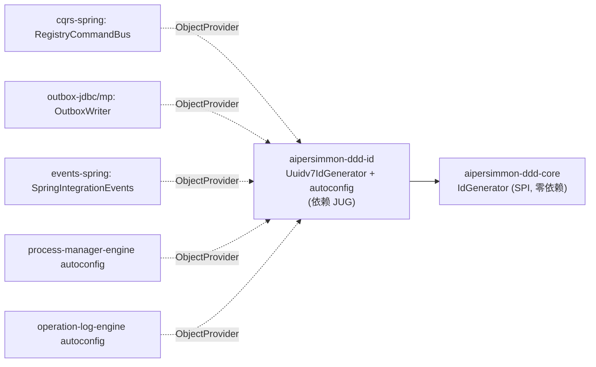

# 时间有序标识符落地计划

> **注（2026-08-06 补）**：本记录写于库同时并存 JDBC 与 MyBatis-Plus 两套存储后端的时期。
> `-persistence-jdbc`、`-outbox-jdbc`、`-inbox-jdbc`、`-process-manager-jdbc`、`-operation-log-jdbc`、
> `-web-store-jdbc`、`-starter-jdbc` 已全部删除（库只留 MyBatis-Plus 后端；web 边界存储由
> `-web-store-mybatis-plus` 承接）。因此下文带 `-jdbc` 的模块名、路径与 `file:line`，指的是当时的代码，
> 不是现在的树；它们作为当时的证据保留，未被改写成 MyBatis-Plus 的路径。

把 [design-00010-time-ordered-identifiers](../design/design-00010-time-ordered-identifiers.md) / [decision-00019-time-ordered-uuidv7-identifiers](../decision/decision-00019-time-ordered-uuidv7-identifiers.md) 落成代码：一个
framework-free 的 `IdGenerator` SPI（`aipersimmon-ddd-core`，零依赖），一个库支撑的 UUIDv7 默认实现（新模块
`aipersimmon-ddd-id` + autoconfig），以及把现有五处 `UUID.randomUUID()` 铸造点统一收口到注入的 `IdGenerator`。
沿用 observability 的既有拆法：**SPI 在 framework-free 模块 / 实现在带依赖的 impl 模块 / 经 autoconfig 装配**。

**验收锚点**：默认装配（引入 `-id` 模块）下，一条命令端到端产出的所有框架铸造 id——command `messageId`、outbox/in-process
`event_id`、process 实例/迁移/effect/deadline id、operation-log `recordId`——均可被 `UUID.fromString` 解析且
**version==7**；`correlationId`/`causationId` 自动继承 v7。**同一进程内不引 `-id` 模块**时（framework-free / 极简装配），
以上铸造点行为等价改造前（回退 `UUID.randomUUID()`，v4），无编译期或运行期硬依赖被强加。当前跑不出即未完成。

**铁律**：
1. **core 保持零第三方运行时依赖**：`IdGenerator` 是纯接口、无 Spring/JDBC/uuid 库依赖（enforcer + ArchUnit 守护不变）。
2. **前向兼容、零 DDL 迁移**：不改任何列/唯一键；v4 老行与 v7 新行合法共存、各自全局唯一。
3. **回退等价**（⚠ **已于 2026-07-26 被推翻，见 [issue-00053-id-generator-silently-degrades-to-uuidv4](../issue/issue-00053-id-generator-silently-degrades-to-uuidv4.md)**：
   该 fallback 使「漏配依赖」与「有意简约装配」在类型上不可区分，等于让本计划要消除的随机主键写放大可以静默
   复现。`aipersimmon-ddd-id` 现为 6 个装配模块的 `compile` 依赖，六处 fallback 已删除，缺 `IdGenerator` 时
   启动失败。本条以下描述仅作历史记录。）：每个消费 autoconfig 用 `ObjectProvider<IdGenerator>`——present 用之，absent 保留现有
   `UUID.randomUUID()` 默认；缺 `-id` 模块时行为与改造前逐字节等价。
4. **不改身份语义**：id 皆不透明 String，无 `UUID.fromString` 解析假设被引入到业务/框架路径（测试断言不得依赖 v4 随机性，
   也不得反过来把 v7 的时间有序当作契约向消费方暴露）。
5. **选 v7、不选 ULID**：保持 36 字符 UUID 形态、对 `UUID.randomUUID().toString()` 无缝替换；用库的**同毫秒单调**变体。
6. **不涵盖**（非目标，保留现状）：`tenant_id`（低基数、要窄+不可变，见 [decision-00018-multi-tenancy-boundaries](../decision/decision-00018-multi-tenancy-boundaries.md) 命题四）、
   web `RequestIdFilter` 的 `requestId`、lease `WorkerId`、客户端提供的 web idempotency/nonce/bucket key、消费方聚合业务键。

## 一、Design

详见 [design-00010-time-ordered-identifiers](../design/design-00010-time-ordered-identifiers.md)。落地关键：**这是一次算法替换，不是结构改造**——五处铸造点多数已是可注入
`Supplier<String>`（`RegistryCommandBus.idGenerator`、process-manager `randomIds()`、operation-log recordId supplier），
只有 `OutboxWriter`（jdbc + mp）与 `SpringIntegrationEvents` 现为内联 `UUID.randomUUID()`，需先提为可注入依赖再收口。

模块：新增 `aipersimmon-ddd-id`（impl，携 UUIDv7 库 + autoconfig）；改造 `aipersimmon-ddd-core`（加 SPI）、`cqrs-spring`、
`outbox-jdbc`、`outbox-mybatis-plus`、`events-spring`、`process-manager-engine`、`operation-log-engine`；`bom` + 根 `pom.xml`
reactor 收录新模块。

## 二、任务

> 约定：`[core]` 等标模块；「并行」表示与同批无强依赖。每个任务 test-first，含单测。库版本在 T2 pin。

### P0 · SPI 与实现模块骨架（前置）

- **T0** `[core]` 定义 SPI：`IdGenerator`（`@FunctionalInterface`，`String newId()`，Javadoc 声明「全局唯一、时间有序、
  默认 UUIDv7」）。放 `com.aipersimmon.ddd.core`（或与既有 SPI 同包）。**不引任何依赖**；`mvn verify` 下 enforcer/ArchUnit
  仍确认 core 零运行时第三方依赖。单测占位（接口可作 `Supplier<String>` 适配：`idGenerator::newId`）。
- **T1** `[repo]` 新增模块 `aipersimmon-ddd-id`：pom（parent = aipersimmon-ddd-parent，`compile` 依赖 core + UUIDv7 库）、
  `package-info`、根 `pom.xml` reactor `<module>`（列在 `core` 之后、consumer 模块之前）、`bom` 的 `<dependencyManagement>`
  条目。空 autoconfig 占位 + `META-INF/spring/org.springframework.boot.autoconfigure.AutoConfiguration.imports`（Spring 可选依赖）。

### P1 · 默认实现（依赖 T0/T1）

- **T2** `[id]` `Uuidv7IdGenerator implements IdGenerator`：首选 **JUG**（`com.fasterxml.uuid:java-uuid-generator`，pin
  ≥ 支持 v7 的版本，如 5.1.0）`Generators.timeBasedEpochGenerator()`（UUIDv7，同毫秒单调变体），`newId()` 返回
  `gen.generate().toString()`。**单测**：产出可被 `UUID.fromString` 解析、`version()==7`、同毫秒内严格单调递增、
  多线程并发无重复（N 线程 × M 次收集入 `Set` 断言无碰撞）。
- **T3** `[id]` autoconfig：`@AutoConfiguration` + `@ConditionalOnMissingBean(IdGenerator.class)` 装 `Uuidv7IdGenerator`；
  写入 `AutoConfiguration.imports`。**装配测**：`ApplicationContextRunner` 验证默认装 `Uuidv7IdGenerator`、
  消费方 `@Primary`/自定义 `IdGenerator` 可覆盖、无本模块时上下文不报缺 bean（由消费方 `ObjectProvider` 兜底）。

### P2 · 铸造点收口（每处 test-first；组内并行）

- **T4** `[cqrs-spring]` `RegistryCommandBus` 现已是可注入 `Supplier<String> idGenerator`（默认 `() -> UUID.randomUUID()...`）。
  改其 spring autoconfig：注入 `ObjectProvider<IdGenerator>`，present → `idGenerator::newId`，absent → 保留 `UUID.randomUUID()`
  默认。`RegistryCommandBus` 构造签名不变（仍收 `Supplier<String>`）。**测**：装配测证明有 `-id` 时 `messageId` 为 v7、
  `correlationId`/`causationId` 继承；无 `-id` 时仍 v4；既有 command-bus 测保持绿（断言不依赖 id 随机性）。
- **T5** `[events-spring]` `SpringIntegrationEvents`：把内联 `UUID.randomUUID().toString()`（`publish`）提为构造注入的
  `Supplier<String> idGenerator`（默认 `() -> UUID.randomUUID()...`，保留现有构造重载兼容）；`publishAs` 不铸造 id（沿用
  `context.messageId()`），不动。其 autoconfig 经 `ObjectProvider<IdGenerator>` 装配。**测**：in-process `event_id` v7/v4 二态。
- **T6** `[outbox-jdbc]` + `[outbox-mybatis-plus]` `OutboxWriter`：把 `publish` 内联 `UUID.randomUUID().toString()` 提为
  构造注入的 `Supplier<String> idGenerator`（保留现有构造重载 + 新增带 supplier 的重载）；`publishAs` 不动。两个后端 autoconfig
  经 `ObjectProvider<IdGenerator>` 装配。**测**：`event_id` v7/v4 二态；`OutboxRelay` 行→`OutboxMessage` 映射不受影响。
- **T7** `[process-manager-engine]` autoconfig `randomIds()`（现 `() -> UUID.randomUUID()...`，喂 relay/worker/store 多处）：
  改为注入 `ObjectProvider<IdGenerator>`，present → `idGenerator::newId`，absent → 保留 `randomIds()`。覆盖全部 `randomIds()`
  调用点（instance/transition/effect/deadline id）。**测**：process 实例/迁移/effect/deadline id v7/v4 二态；既有 engine 测绿。
- **T8** `[operation-log-engine]` autoconfig recordId supplier（现 `() -> UUID.randomUUID()...`，DDL 注释早已声明 v7）：
  经 `ObjectProvider<IdGenerator>` 装配，兑现注释。**测**：`recordId` v7/v4 二态；operation-log e2e 场景断言不依赖随机性。

### P3 · 兼容、回退与横切验证

- **T9** `[id/starter]` 让 v7 **默认开启**：把 `aipersimmon-ddd-id` 纳入标准 starter/聚合依赖路径（随其余框架模块一并进
  应用 classpath），使默认应用无需显式声明即得 v7；文档化「不引 `-id` = 回退 v4」的极简装配路径。
- **T10** `[test]` **收口回归 + 二态矩阵**：跨模块集成测证明——(a) 引 `-id` 时上述五类 id 全 v7 且 `correlationId`/
  `causationId` 继承；(b) 不引 `-id` 时全回退 v4、无缺 bean 报错、行为等价改造前；(c) 全库仍**无** `UUID.fromString` 出现在
  非测试/非 id-impl 路径（守护 id 不透明性）。
- **T11** `[docs/optional]` **（非门禁）局部性基准**：说明性 benchmark，对比 v4/v7 在 process 表大批量插入下的索引页分裂/
  写放大，佐证决策动机。仅作文档，不入 CI 门禁。

## 实现状态（2026-07-24 落地）

全部 T0–T10 已实现并通过门禁（新模块 + 五铸造点收口 + 二态测试；`verify` 下 pitest/jacoco ≥90% 全绿）：

- **T0/T1** ✅ `IdGenerator` SPI 落 `aipersimmon-ddd-core`（`com.aipersimmon.ddd.core.id`，零依赖）；新模块
  `aipersimmon-ddd-id`（reactor + BOM + parent `dependencyManagement` 管 JUG `com.fasterxml.uuid:java-uuid-generator:5.1.0`）。
- **T2/T3** ✅ `Uuidv7IdGenerator`（JUG `timeBasedEpochGenerator()` — **同毫秒单调**变体，经内部锁线程安全）+ `@AutoConfiguration`
  `@ConditionalOnMissingBean`；单测（可解析/version==7/同毫秒单调/并发唯一）+ `ApplicationContextRunner` 装配测（默认装/可覆盖）。
- **T4–T8** ✅ 五处铸造点全部经 `ObjectProvider<IdGenerator>` 收口（present→`newId`，absent→`UUID.randomUUID()`）：
  cqrs-spring `RegistryCommandBus`、events-spring `SpringIntegrationEvents`、outbox-jdbc/-mybatis-plus `OutboxWriter`、
  process-manager-engine autoconfig `randomIds()`→`ids(idGenerator)`（4 bean 方法）、operation-log-engine `recordId` supplier。
  `SpringIntegrationEvents`/`OutboxWriter` 各加带 `Supplier<String>` 的构造重载（旧构造保留，默认 v4）。
- **T9** ✅ `aipersimmon-ddd-id` 纳入 multi-module scaffold `start` pom → 参考应用默认开启 v7。
- **T10** ✅ 二态验证：cqrs-spring 旗舰两态测（有 `-id`→v7 / 无→v4，真实装配）、events/outbox/operation-log 各注入哨兵证明铸造点
  取自注入 supplier、process-manager-jdbc 真实 `Uuidv7IdGenerator` 起流程证明实例 id 为 v7；全 reactor `test-compile` 无下游破坏。
- **未动**（非目标）：`RequestIdFilter.requestId`、`WorkerId`、`tenant_id`、web 客户端键 —— 与多租户正交，`tenant_id` 明确不用 v7。

## 三、验收路径

1. T0/T1 绿：SPI 落于零依赖 core，`-id` 模块骨架 + reactor + BOM 到位。
2. T2/T3 绿：`Uuidv7IdGenerator` 产出合法 v7（可解析 / version==7 / 同毫秒单调 / 并发唯一），autoconfig 默认装 + 可覆盖 + 缺失不报错。
3. T4–T8 绿：五处铸造点各自证明 v7/v4 二态切换，既有测全绿（不依赖 id 随机性）。
4. T9 绿：默认应用无需显式声明即得 v7；极简装配可回退 v4。
5. **T10 二态矩阵全绿** = 完成（T11 为可选佐证，不阻塞）。

## 四、关联
- 决策 [decision-00019-time-ordered-uuidv7-identifiers](../decision/decision-00019-time-ordered-uuidv7-identifiers.md)（承接 [decision-00013-command-context-and-causation-propagation](../decision/decision-00013-command-context-and-causation-propagation.md)
  的 id 铸造点、[decision-00016-durable-runtime-staged-message-identity](../decision/decision-00016-durable-runtime-staged-message-identity.md) 的 staged 身份）
- 设计 [design-00010-time-ordered-identifiers](../design/design-00010-time-ordered-identifiers.md)
- 正交于多租户 [decision-00018-multi-tenancy-boundaries](../decision/decision-00018-multi-tenancy-boundaries.md) / [plan-00011-multi-tenancy-implementation](plan-00011-multi-tenancy-implementation.md)（`tenant_id` 明确不用 UUIDv7）
- 复用装配拆法：observability（SPI in framework-free / impl in impl module / autoconfig）
