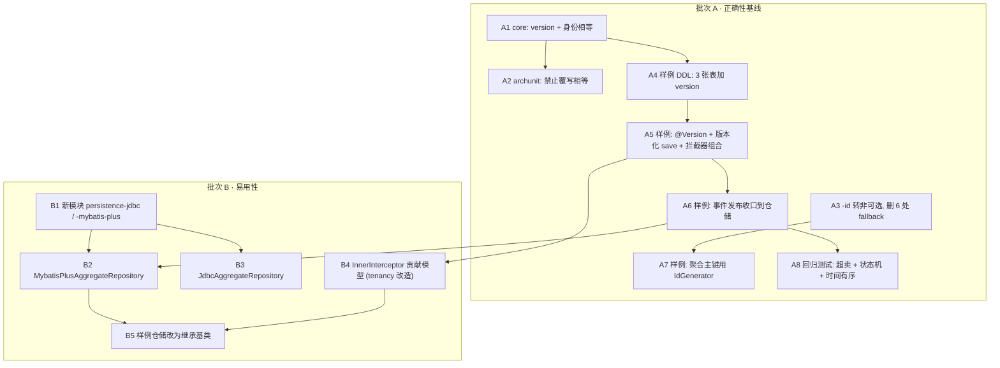

# 阶段一：正确性止血落地计划

把 [[report-00001-ddd-framework-review]] 的阶段一（P0-1 / P0-2 / P0-3 / P0-4 / P2-5）落成代码。目标是让框架在
**「聚合是一个事务一致性单元」**这个 DDD 最核心的承诺上真正成立——当前它只是文档声明，运行期不成立。

**验收锚点**：同一 SKU 的两个并发预留，恰好一方成功；`sum(reservation_lines.quantity) + stocks.available`
在任意并发压力下恒等于初始库存。当前跑不出即未完成。

**铁律**：
1. **core 保持零第三方运行时依赖**。`version` 是一个 `long` 字段，不引入任何依赖（enforcer + ArchUnit 守护不变）。
2. **不引入通用 CRUD 端口**。领域仓储端口仍由消费方在 domain 层定义；框架只提供基类，不提供
   `AggregateRepository<A, ID>`（详见 [[design-00011-aggregate-persistence-contract]] §2）。
3. **能力降级必须显式**。本阶段修掉的 P0-3 正是「可选能力静默缺席」，因此本阶段自身**不得**引入同类静默——
   尤其是 MyBatis-Plus 拦截器组合（design-00011 §3 的陷阱）。
4. **`version` 不参与身份**。不进 `equals`/`hashCode`，不进 `Association`，不向消费方的领域语言泄漏。
5. **不涵盖**（非目标）：悲观锁、跨聚合事务协调、读模型版本化、`ordering.customers`（只读聚合，无 `save` 端口）。

## 一、Design

契约与基类设计见 [[design-00011-aggregate-persistence-contract]]。本计划只负责落地顺序。

**为什么批次 A 不做「提交前 fail-loud 兜底」**：报告 P0-2 的方案 B 是在 `TransactionCommandInterceptor` 提交前
扫描「被 save 过但仍有未清空事件的聚合」。一旦 A6 把 `publishAndClear` 收口进仓储 `save()`，
「被 save 过的聚合」的事件集合**恒为空**，该检查退化为恒真断言，无信息量。它唯一能捕获的残余场景是
「聚合被改但从未 save」——而那连状态变更本身都丢了，是功能性可见的失败，不是静默事件丢失。故本阶段
**有意不实现该兜底**，把 P0-2 的根治交给 A6（收口）+ B2（基类使遗漏结构上不可能）。这是对报告的一处有意收窄，
理由记录在此。

## 二、任务

> 约定：`[core]` 等标模块；每个任务 test-first。批次 A 内 A1/A2/A3 与 A4–A8 可并行起步，A4→A5→A6→A8 有序。

### 批次 A · 正确性基线

- **A1** `[core]` `AbstractAggregateRoot`：加 `private long version`（不标 `transient`）+ `protected final
  restoreVersion(long)` + `public final version()` + `public final versionAdvanced()`；实现 `final equals`
  （`getClass()` 比较 + `id()` 比较）与 `final hashCode`（`Objects.hashCode(id())`）。
  **测**：新建聚合 `version()==0`；rehydrate 后为持久化值；`versionAdvanced()` 后 +1；同 id 不同实例相等且
  `Set` 去重为 1；不同 id 不等；不同具体类型同 id 不等；`null`/异类不等；`version` 不影响相等。
  → [[issue-00051-aggregates-have-no-optimistic-locking]]、[[issue-00055-aggregate-root-missing-identity-equality]]
- **A2** ~~`[archunit]` 新增 `aggregateRootsShouldNotOverrideEquality()`~~ —— **已取消（实施中判定为冗余）**。
  A1 把 `equals`/`hashCode` 声明为 `final`，子类覆写是**编译期错误**；而既有
  `BuildingBlockRules.aggregateRootsShouldExtendAbstractAggregateRoot()` 已强制 `@AggregateRoot` 类型继承基类。
  两者叠加已完整保证身份相等语义，ArchUnit 规则**永远不可能命中**——一条不可能失败的规则只是噪声
  （`CODE_QUALITY.md` §7「Metric-as-goal」与 `AGENTS.md` §2「Nothing speculative」）。报告 P2-5 提出该规则时
  尚未确定用 `final`，故此处收窄。
  → [[issue-00055-aggregate-root-missing-identity-equality]]
- **A3** `[id]`+6 模块 `-id` 由 `test` 提为 `compile`（`cqrs-spring/pom.xml:80-85`），其余消费模块补依赖；
  删除 6 处 `generator != null ? ... : () -> UUID.randomUUID()...` 三元，改为直接注入 `IdGenerator`；
  移除 `RegistryCommandBus` / `SpringIntegrationEvents` / `OutboxWriter`(×2) 的「无 supplier」构造重载。
  保留 `@ConditionalOnMissingBean` 可覆盖性。**测**：装配测断言默认 `messageId`/`event_id` 均 `version()==7`；
  自定义 `IdGenerator` 仍可覆盖。**并为 [[plan-00012-time-ordered-identifiers-implementation]] 补一条 patch**
  说明其「铁律 3（回退等价）」被本任务有意推翻。
  → [[issue-00053-id-generator-silently-degrades-to-uuidv4]]
- **A4** `[sample]` 新迁移 `V3__aggregate_version.sql`：`ordering.orders` / `inventory.stocks` /
  `inventory.reservations` 各加 `version BIGINT NOT NULL DEFAULT 0`。不动 `ordering.customers`（只读聚合）。
  → [[issue-00051-aggregates-have-no-optimistic-locking]]
- **A5** `[sample]` `OrderDo` / `StockDo` / `ReservationDo` 加 `@Version private Long version`；rehydrate 工厂
  （`Order.reconstitute`、`Stock`、`Reservation`）多带 version 参数并 `restoreVersion`；3 个仓储改为
  「`version()==0` → `insert`，否则 `updateById`」+ affected-rows 检查，`0` 行抛
  `OptimisticLockingFailureException`；删除 `selectById` 预查（消 TOCTOU）。
  **在 `start` 注册一个自有 `MybatisPlusInterceptor`**，组合 `TenantLineInnerInterceptor`（沿用 tenancy 的
  handler 与属性）+ `OptimisticLockerInnerInterceptor`——tenancy autoconfig 按其既有 `@ConditionalOnMissingBean`
  文档整体退让。**测**：装配测断言该 interceptor 同时含两个 inner interceptor（防止退让把租户隔离一起关掉）；
  既有 `TwoTenantAcceptanceTest` 必须保持绿。
  → [[issue-00051-aggregates-have-no-optimistic-locking]]、[[design-00011-aggregate-persistence-contract]] §3
- **A6** `[sample]` 3 个仓储在 `save()` 末尾 `domainEvents.publishAndClear(aggregate)`；删除
  `PlaceOrderHandler:114` / `ConfirmOrderHandler:41` / `CancelOrderHandler:39` / `FulfilmentTrigger:46`
  四处手工调用。同步修正 `application/DomainEvents.java` 的 Javadoc（删掉 "or the handler" 这一歧义授权）
  与 `TransactionCommandInterceptor.java:13-16` 的说明。**测**：`OrderingFlowTest` 断言下单后 outbox 确有
  `OrderPlacedEvent`（防止收口把正常路径挡掉）；各 handler 单测断言事件仍被发布。
  → [[issue-00052-domain-events-lost-when-publish-and-clear-forgotten]]
- **A7** `[sample]`+`[core]` `PlaceOrderHandler:102` 的 `OrderId` 与 `ReserveStockHandler:77` 的
  `ReservationId` 改由注入的 `IdGenerator` 铸造；**`core/id/IdGenerator.java` Javadoc 把「业务聚合/实体主键」
  显式列为推荐用途**（本 issue 的根因）。**测**：`AggregateIdIsTimeOrderedTest` 断言返回的 orderId
  `UUID.fromString(...).version()==7`，且连续下单 id 字典序与创建先后一致。
  → [[issue-00054-sample-aggregate-ids-use-random-uuid]]
- **A8** `[sample]` 两个并发回归测试（Testcontainers PostgreSQL + `CyclicBarrier` 确定性交错）：
  `ConcurrentStockReservationTest`（**主**：断言恰好一方成功 + 守恒式
  `sum(reservation_lines.quantity) + stocks.available == 初始值`）与 `ConcurrentOrderModificationTest`
  （**次**：断言恰好一方抛 `ConcurrencyConflictException`，outbox 只有胜者的事件）。
  → [[issue-00051-aggregates-have-no-optimistic-locking]]

### 批次 B · 易用性（依赖批次 A 全绿）

- **B1** `[repo]` 新增 `aipersimmon-ddd-persistence-mybatis-plus` 与 `aipersimmon-ddd-persistence-jdbc`：
  pom（parent + 依赖 `-core`/`-application`）、`package-info`、根 `pom.xml` reactor、BOM 条目。
- **B2** `[persistence-mybatis-plus]` `VersionedRow`（`getVersion`/`setVersion`）+
  `MybatisPlusAggregateRepository`（模板方法 `save`：搬运 version → insert/updateById → affected-rows 检查 →
  `saveChildren` → `versionAdvanced` → `publishAndClear`；抽象 `toRow`，可选 `saveChildren`）。
  **测**：新建走 insert、已存在走 update、版本不匹配抛 `OptimisticLockingFailureException`、事件被发布且清空、
  子表钩子被调用。
- **B3** `[persistence-jdbc]` `JdbcAggregateRepository`（抽象 `insert` / `update(A, long expectedVersion)`，
  其余同 B2）。**测**：同上；另断言 `expectedVersion` 被传入。
- **B4** `[tenancy-mybatis-plus]`+`[新]` 落地 design-00011 §3 的 `InnerInterceptor` 贡献模型：框架持有唯一
  `MybatisPlusInterceptor`，按 `@Order` 收集 `ObjectProvider<InnerInterceptor>`；tenancy 改为贡献
  `TenantLineInnerInterceptor` bean（`@Order(100)`），`persistence-mybatis-plus` 贡献
  `OptimisticLockerInnerInterceptor`（`@Order(300)`）。保留「消费方自定义 `MybatisPlusInterceptor` 则整体退让」
  的逃生舱。**测**：同时开启 tenancy + persistence 时两个 inner interceptor **都**在（这正是 A5 手工组合要
  防的静默退让，此处由框架保证）；消费方自定义时框架整体退让。
- **B5** `[sample]` 3 个仓储改为继承 B2 基类，删除 A5 在 `start` 里的手工 `MybatisPlusInterceptor` 组合与
  仓储内的样板；A8 的回归测试**不改一行**仍须全绿（这是「基类等价于手写版本化写入」的证明）。

## 三、验收路径

**逐任务验收**：每个任务的 `测` 项全绿，且 `mvn -f aipersimmon-ddd/pom.xml verify`（Spotless + PMD/CPD +
SpotBugs）通过。样例侧同时跑 `mvn -f aipersimmon-ddd-scaffold/multi-module/pom.xml verify`。

**阶段验收**（缺一不可）：

1. **超卖不可能**：`ConcurrentStockReservationTest` 绿——恰好一方成功，守恒式成立。
2. **状态机不可绕过**：`ConcurrentOrderModificationTest` 绿——恰好一方 409，outbox 只有胜者事件。
3. **冲突链路不再是死代码**：存在一条从 `OptimisticLockingFailureException` →
   `ConcurrencyConflictException` → HTTP 409 的、被测试覆盖的真实路径。
4. **事件不可静默丢失**：4 处 handler 已无手工 `publishAndClear`，且 `OrderingFlowTest` 证明事件仍到达 outbox。
5. **时间有序 id 覆盖聚合主键**：`AggregateIdIsTimeOrderedTest` 绿；全仓 `grep` 确认样例业务代码内已无
   `UUID.randomUUID()` 用于聚合主键。
6. **身份相等成立**：同一聚合加载两次相等且 `Set` 去重为 1；ArchUnit 规则拦住覆写。
7. **多租户未被削弱**：`TwoTenantAcceptanceTest` 保持绿（A5/B4 的拦截器改动没有关掉租户隔离）。
8. **既有测试无回归**：框架 + 样例全量测试绿。
9. **文档闭环**：5 个 issue 均转 `resolved` 并填「验证结果」；design-00011 转 `active`；本 plan 转 `resolved`;
   `plan-00012` 收到关于「铁律 3 被推翻」的 patch。

**提交切分**（每批一个逻辑变更，见 `COMMIT.md`）：
`docs` (本批文档) → `feat(core)` A1+A2 → `refactor(id)` A3 → `feat(scaffold)` A4+A5 → `refactor(scaffold)` A6 →
`refactor(scaffold)` A7 → `test(scaffold)` A8 → 批次 B 同理逐任务提交。

## 关联

- [[report-00001-ddd-framework-review]]（阶段一的来源与优先级依据）
- [[design-00011-aggregate-persistence-contract]]（契约与基类设计）
- [[issue-00051-aggregates-have-no-optimistic-locking]] · [[issue-00052-domain-events-lost-when-publish-and-clear-forgotten]] ·
  [[issue-00053-id-generator-silently-degrades-to-uuidv4]] · [[issue-00054-sample-aggregate-ids-use-random-uuid]] ·
  [[issue-00055-aggregate-root-missing-identity-equality]]
- [[plan-00012-time-ordered-identifiers-implementation]]（A3 推翻其铁律 3）
- [[design-00009-multi-tenancy-tenant-id]]（B4 改造其拦截器装配）
