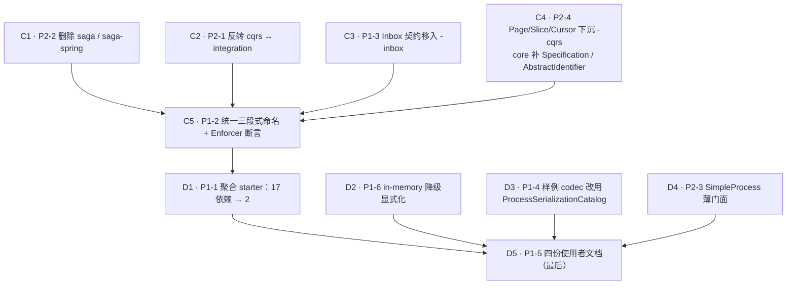

# 阶段二 + 阶段三：采纳门槛与架构精简

承接 [[report-00001-ddd-framework-review]]。阶段一（正确性止血）已由
[[plan-00013-phase-one-correctness-remediation]] 完成。本 plan 覆盖报告的**阶段二（采纳门槛）与阶段三
（架构精简）全部 10 项**。

## 一、为什么把两个阶段合并、并且反转它们的顺序

报告按**价值**排序：阶段二 ROI 最高所以排在前。但按**依赖**排序，方向恰好相反：

- **P1-1（聚合 starter）** 的产出物是「按最终模块名聚合的 pom」。若在 P1-2（统一命名）之前做，
  每个 starter 的依赖清单都要在改名后重写一遍。
- **P1-5（四份使用者文档）** 要写的正是「模块分层图 + 40 个模块职责表 + 该加哪个 starter」。
  在 P2-2（删 saga）、P1-2（改名）、P1-1（starter）之前写，等于承诺一份出厂即过期的文档。
- **P2-4（`Page`/`Slice`/`Cursor` 下沉到 `-cqrs`）** 和 **P2-1（反转 `cqrs` ↔ `integration`）**
  都改变模块图，starter 的依赖闭包随之变化。

所以执行顺序是：**先阶段三的结构改动 → 再阶段二的 starter → 文档收尾**。这不是否定报告的优先级判断
（阶段二仍然是价值最高的阶段），而是承认「文档和 starter 是模块图的函数，必须最后固化」。

## 二、批次与依赖

C1–C4 之间互不依赖，可任意顺序；C5（改名）必须在四者之后，因为它要重命名的模块集合由前四项决定。
D2/D3/D4 与 D1 无依赖，但都必须早于 D5。

## 三、逐项验收标准

| 批次 | 项 | 完成判据（可验证） |
| --- | --- | --- |
| C1 | P2-2 | `aipersimmon-ddd-saga*` 目录、反应堆 `<modules>`、BOM 条目、spotbugs-exclude 条目全部消失；全量 `install` 绿；`CONTEXT.md` 的 "_Avoid_: Saga" 保留（删模块后这条纪律更成立） |
| C2 | P2-1 | `cqrs/pom.xml` 不再依赖 `-integration`；`CommandContext.of(EventEnvelope)` 删除；`integration` 侧有 `EventEnvelopes.toCommandContext`；入站适配器（Kafka listener + 样例）改用新入口 |
| C3 | P1-3 | `Inbox.java` 位于 `aipersimmon-ddd-inbox`，`-application` 不再持有它；`-inbox` 从「只有 DDL」变成有契约，与 outbox 对称 |
| C4 | P2-4 | `Page`/`Slice`/`Cursor` 在 `-cqrs`，`-web` 只保留其 HTTP 序列化；`core` 新增 `Specification<T>` 与 `AbstractIdentifier`；样例的 `OrderId`/`CustomerId` 改用基类以证明它真的省事 |
| C5 | P1-2 | 三段式命名全量对齐；**Enforcer/ArchUnit 断言**「artifactId 不含 `spring` 的模块不得依赖 `org.springframework`」，且该断言在故意加一条 Spring 依赖时会红 |
| D1 | P1-1 | `multi-module/start/pom.xml` 的 aipersimmon 依赖从 17 条降到 2 条（+ test scope），且样例全部 157 项测试**不改一行测试代码**仍绿 |
| D2 | P1-6 | 幂等/重放/限流启用而 classpath 无 `-web-store-*` 时启动 WARN + health degraded；有开关可令其 fail-loud |
| D3 | P1-4 | `OrderFulfilmentCodecs.java` 282 行 → 约 15 行的 catalog bean；流程测试不改仍绿；保留一份手写 codec 作为进阶示例并注明适用条件 |
| D4 | P2-3 | `SimpleProcess` 门面可用 5 个以内概念跑通一条 3 步流程；完整 `ProcessDefinition` 路径不变（渐进式披露，不削弱引擎） |
| D5 | P1-5 | README（框架版，2 依赖 5 分钟跑通）/ ARCHITECTURE（四层模块图 + 职责表）/ 选择指南（决策树）/ 配置参考（`aipersimmon.ddd.*` 全项） |

## 四、铁律

1. **细粒度模块一个都不删**（除 saga）。starter 只是**默认路径**，高级用户精确挑选的能力不能受损——
   这是可扩展性的底线。
2. **改名与移动必须机械可验证**：每批结束跑全量 `install`（框架）+ `verify`（样例）。样例是唯一的
   端到端消费者，它绿才算改对。
3. **不因为 starter 而放宽条件装配**。所有组件已是 `@ConditionalOnMissingBean` / `@ConditionalOnClass`
   风格，starter 只做 pom 聚合 + 必要的 `@AutoConfiguration` 顺序声明。
4. **文档最后写**，且只写报告点名的四份；150 篇内部设计文档一篇不动。
5. **遇到缺陷先立 issue**（AGENTS.md §7），不在本 plan 里顺手修。
6. **D4（`SimpleProcess`）是新公开 API**，实施前必须先有 design 文档；若评估后判断它会造成「两套流程写法」
   的概念分裂，宁可不做并在此记录理由——报告本身把它排在最后，说明它不是必做项。

## 五、完成记录

（逐批填写。）

## 关联

- [[report-00001-ddd-framework-review]]（本 plan 的来源）
- [[plan-00013-phase-one-correctness-remediation]]（阶段一，已 resolved）
- [[design-00011-aggregate-persistence-contract]]（阶段一产出的仓储基类，D1 的 starter 要覆盖它）
