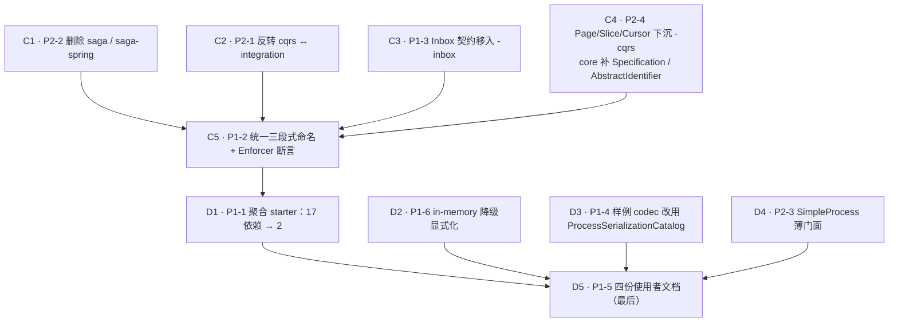

# 阶段二 + 阶段三：采纳门槛与架构精简

承接 [[report-00001-ddd-framework-review]]。阶段一（正确性止血）已由
[[plan-00013-phase-one-correctness-remediation]] 完成。本 plan 覆盖报告的**阶段二（采纳门槛）与阶段三
（架构精简）全部 10 项**。

## 一、为什么把两个阶段合并、并且反转它们的顺序

报告按**价值**排序：阶段二 ROI 最高所以排在前。但按**依赖**排序，方向恰好相反：

- **P1-1（聚合 starter）** 的产出物是「按最终模块名聚合的 pom」。若在 P1-2（统一命名）之前做，
  每个 starter 的依赖清单都要在改名后重写一遍。
- **P1-5（四份使用者文档）** 要写的正是「模块分层图 + 40 个模块职责表 + 该加哪个 starter」。
  在 P2-2（删 saga）、P1-2（改名）、P1-1（starter）之前写，等于承诺一份出厂即过期的文档。
- **P2-4（`Page`/`Slice`/`Cursor` 下沉到 `-cqrs`）** 和 **P2-1（反转 `cqrs` ↔ `integration`）**
  都改变模块图，starter 的依赖闭包随之变化。

所以执行顺序是：**先阶段三的结构改动 → 再阶段二的 starter → 文档收尾**。这不是否定报告的优先级判断
（阶段二仍然是价值最高的阶段），而是承认「文档和 starter 是模块图的函数，必须最后固化」。

## 二、批次与依赖

C1–C4 之间互不依赖，可任意顺序；C5（改名）必须在四者之后，因为它要重命名的模块集合由前四项决定。
D2/D3/D4 与 D1 无依赖，但都必须早于 D5。

## 三、逐项验收标准

| 批次 | 项 | 完成判据（可验证） |
| --- | --- | --- |
| C1 | P2-2 | `aipersimmon-ddd-saga*` 目录、反应堆 `<modules>`、BOM 条目、spotbugs-exclude 条目全部消失；全量 `install` 绿；`CONTEXT.md` 的 "_Avoid_: Saga" 保留（删模块后这条纪律更成立） |
| C2 | P2-1 | `cqrs/pom.xml` 不再依赖 `-integration`；`CommandContext.of(EventEnvelope)` 删除；`integration` 侧有 `EventEnvelopes.toCommandContext`；入站适配器（Kafka listener + 样例）改用新入口 |
| C3 | P1-3 | `Inbox.java` 位于 `aipersimmon-ddd-inbox`，`-application` 不再持有它；`-inbox` 从「只有 DDL」变成有契约，与 outbox 对称 |
| C4 | P2-4 | `Page`/`Slice`/`Cursor` 在 `-cqrs`，`-web` 只保留其 HTTP 序列化；`core` 新增 `Specification<T>` 与 `AbstractIdentifier`；样例的 `OrderId`/`CustomerId` 改用基类以证明它真的省事 |
| C5 | P1-2 | 三段式命名全量对齐；**Enforcer/ArchUnit 断言**「artifactId 不含 `spring` 的模块不得依赖 `org.springframework`」，且该断言在故意加一条 Spring 依赖时会红 |
| D1 | P1-1 | `multi-module/start/pom.xml` 的 aipersimmon 依赖从 17 条降到 2 条（+ test scope），且样例全部 157 项测试**不改一行测试代码**仍绿 |
| D2 | P1-6 | 幂等/重放/限流启用而 classpath 无 `-web-store-*` 时启动 WARN + health degraded；有开关可令其 fail-loud |
| D3 | P1-4 | `OrderFulfilmentCodecs.java` 282 行 → 约 15 行的 catalog bean；流程测试不改仍绿；保留一份手写 codec 作为进阶示例并注明适用条件 |
| D4 | P2-3 | `SimpleProcess` 门面可用 5 个以内概念跑通一条 3 步流程；完整 `ProcessDefinition` 路径不变（渐进式披露，不削弱引擎） |
| D5 | P1-5 | README（框架版，2 依赖 5 分钟跑通）/ ARCHITECTURE（四层模块图 + 职责表）/ 选择指南（决策树）/ 配置参考（`aipersimmon.ddd.*` 全项） |

## 四、铁律

1. **细粒度模块一个都不删**（除 saga）。starter 只是**默认路径**，高级用户精确挑选的能力不能受损——
   这是可扩展性的底线。
2. **改名与移动必须机械可验证**：每批结束跑全量 `install`（框架）+ `verify`（样例）。样例是唯一的
   端到端消费者，它绿才算改对。
3. **不因为 starter 而放宽条件装配**。所有组件已是 `@ConditionalOnMissingBean` / `@ConditionalOnClass`
   风格，starter 只做 pom 聚合 + 必要的 `@AutoConfiguration` 顺序声明。
4. **文档最后写**，且只写报告点名的四份；150 篇内部设计文档一篇不动。
5. **遇到缺陷先立 issue**（AGENTS.md §7），不在本 plan 里顺手修。
6. **D4（`SimpleProcess`）是新公开 API**，实施前必须先有 design 文档；若评估后判断它会造成「两套流程写法」
   的概念分裂，宁可不做并在此记录理由——报告本身把它排在最后，说明它不是必做项。

## 五、完成记录

### 批次 C（结构精简）—— 已完成

| 批次 | commit | 结果 |
| --- | --- | --- |
| C1 | `b2afc6e` `d1bdef6` | 删除 `-saga` / `-saga-spring`（34 文件、-1180 行）；顺带把样例里 ~35 处「saga」改为「process manager」 |
| C2 | `d4947b7` | `cqrs` 不再依赖 `integration`；转换点落在 `application.InboundEvents.commandContext` |
| C3 | `8e68c73` | `Inbox` 移入 `-inbox`，与 outbox 对称 |
| C4 | `ff39a4e` | `Page`/`Slice`/`Cursor` 下沉 `-cqrs`；`core` 新增 `Specification<T>` |
| C5 | `1a61409` `d700d3c` | 8 个模块改名统一为 `-spring-boot-starter`；`-outbox` 拆出 Spring 半边；新增 `ModuleNamingChecks` 断言 |

每批均以「框架 `install`（全质量门）+ 样例 `verify`」验收。C5 结束时：框架 **741 项测试全绿**，样例 BUILD SUCCESS。

### 偏差记录（6 处）

1. **C2 的落点从 `integration` 改为 `application`**。报告 P2-1 提议在 `integration` 侧提供
   `EventEnvelopes.toCommandContext`，即 `integration → cqrs`。但 `integration` 当前**零内部依赖**，是一个根；
   让它依赖 `cqrs` 会把 `cqrs`+`core`+`tenancy` 拖进每个「只用集成事件」的消费者——**与要修的耦合同构，只是反向**。
   `application` 已同时依赖三者，放那里**不新增任何一条边**，且「入站事件翻译成命令」本就是入站 ACL 的职责。
2. **`AbstractIdentifier` 不做**。报告 P2-4 的前提（「每个 ID 类型都要重写 `value()`/`equals`/`hashCode`/校验」）
   不成立：框架与样例里每个 id 类型都是 **record**——record 免费提供这四项，且**不能继承类**。基类既无必要也
   不可实现。剩下的唯一重复是两行空值校验，不足以让每个项目的每个 id 都 import 一个新类型。
3. **`-money` 模块不做**。报告自己写着「不必自造，直接引 Joda-Money / javax.money」。新建模块属推测性设计。
4. **报告 P1-2 的三段式规则不可照抄**，已由 [[design-00012-module-naming-and-spring-freedom]] 重新表述：
   按字面执行会把 42 个模块变成约 60 个（13 个后端适配器各自再裂一个 starter），与 P1-1 方向相反。真正的
   不变量是「领域层可依赖的模块必须零 Spring」，按此重测**真违规者只有 `-outbox` 一个**；报告点名的 `-id` 与两个
   `-engine` 不持有契约，问题只是「名字没说明自己是什么」。
5. **改名清单从 7 个增至 8 个**：`-operation-log-cqrs-spring` 在 design 初稿的表里被漏掉，改为按 artifactId
   全量扫描 `-spring$` 得出清单后补入。教训已写进该 design。
6. **Java 包名不随 artifactId 改**（`com.aipersimmon.ddd.cqrs.spring` 保持原样）。artifactId 是分发单元的名字，
   包名是代码的名字；同时改会把一次可机械验证的重命名变成一次大规模源码改动。`-outbox` 拆分是唯一例外——
   那里包名必须改（`...outbox.spring`），因为两个模块不能共用一个包。

### 过程中新发现并已修复的缺陷（不在本 plan 原范围）

- [[issue-00056-kafka-tests-pin-a-stale-inbox-schema]] —— 三个 Kafka 消费端集成测试在 HEAD 即红，
  借用的 inbox schema 漏了租户迁移 V2。
- [[issue-00057-unlimited-systemic-retry-is-invisible]] —— 被判为 systemic 的失败无限重试却从不报告原因，
  这是上一条长期不可诊断的原因。

### 批次 D（采纳门槛）—— 已完成

| 批次 | commit | 结果 |
| --- | --- | --- |
| D3 | `6733d70` | 样例 codec 改用 `ProcessSerializationCatalog`：12 个 payload + state → 22 行声明 |
| D2 | `93c1fa7` | in-memory 降级显式化：启动守卫 WARN + `allow-in-memory-stores` 可令其失败 |
| D1 | `b2a88f5` | 4 个捆绑包；样例 aipersimmon 编译依赖 **16 → 4** |
| D4 | `4239757` | 否决 `SimpleProcess`，改为给 `ProcessDefinition` 加默认方法 |
| D5 | 本次 | 四份使用者文档 |

### 批次 D 的偏差记录（5 处）

1. **D3 不是 282 → 15 行，而是 282 → 188 行**（其中 catalog 声明 22 行）。报告假设 13 个 payload 全部可入
   catalog，但 `CancelOrder` 携带 `CancellationReason`——一个 sealed interface。让 Jackson 解它需要在
   **`ordering-domain` 的类型上**加 `@JsonTypeInfo`，那正是分层禁止的基础设施泄漏。因此保留手写 codec，
   并按报告第 2 条把它写成「何时才该手写」的进阶示例。**每个 payload 的样板从约 200 行降到 22 行**是真实收益，
   总行数没降那么多是因为新增了约 60 行「如何选择」的教学注释。
2. **D1 的捆绑包命名用 `-starter-` 中缀，而非报告的 `-<stack>-spring-boot-starter` 后缀**。后者已被 C5 的
   拦截器组合座占用，且二者不能合并（见 [[design-00012-module-naming-and-spring-freedom]] §3.4）。
3. **D1 是 16 → 4，而非报告设想的 17 → 2**。`-openapi-spring-boot-starter` 与
   `-observability-otel-spring-boot-starter` 各自拉一整套有主张的第三方栈（springdoc + Swagger UI、
   整个 OpenTelemetry starter），不应由默认路径替使用者决定。报告 P1-1 把 "observability(no-op)" 列进核心包，
   那指的是 framework-free 的 SPI（已随 cqrs/outbox 传递且默认 no-op），**OTel 绑定是另一件事**。
4. **D2 不做 `/actuator/health` degraded**。需给 `-web-spring-boot-starter` 新增 `spring-boot-actuator`
   依赖，而信息与启动期 WARN/失败完全重合。
5. **D4 否决 `SimpleProcess` 门面**。两条理由：(a) 报告测到的负担主体是 codec，而 D3 已消除；剩下的只是 18 行
   零信息仪式。(b) 报告草拟的 `next(state, input, effects)` 以**可变 effects** 收集副作用，放弃了
   `(state, input) → decision` 的纯函数形状——而报告自己的「不建议改」附录恰恰点名该形状是对的；且它没有
   自然的方式表达 `ignore`（乱序事实的安全语义）。忠于原语义的门面就是 `ProcessDefinition` 改个名字，
   即**一个概念两套 API**。改为在接口上给版本化三方法加默认值：首个流程只实现 3 个方法，版本概念只在真的需要
   第二个版本时出现——同样是渐进式披露，但只有一套 API，且注册表对版本冲突仍 fail-fast。

### 过程中新发现（已立 issue，未修复）

- [[issue-00059-outbox-relay-tests-race-the-startup-poll]] —— outbox 两个后端共 7 个测试类用
  `poll-delay-ms` 大值试图关掉后台调度，但 `@Scheduled(fixedDelay)` 是**先执行再等待**，启动即轮询一次；
  它若持有 ShedLock 锁，测试体那次直接 `relay()` 会被切面整个跳过 → 间歇性失败。**产品行为无误，
  只有测试对调度器的假设是错的。** 标记 `open`。

### 全部 10 项的最终状态

| 报告项 | 结果 |
| --- | --- |
| P1-1 聚合 starter | ✅ 16 → 4 |
| P1-2 统一命名 | ✅ 8 改名 + `-outbox` 拆分 + 构建期断言 |
| P1-3 `Inbox` 归位 | ✅ |
| P1-4 样例 codec | ✅ 样板 200 → 22 行 |
| P1-5 使用者文档 | ✅ README / CHOOSING-MODULES / CONFIGURATION / ARCHITECTURE |
| P1-6 in-memory 降级 | ✅ WARN + 可 fail-loud |
| P2-1 `cqrs` ↔ `integration` | ✅（落点改为 `application`） |
| P2-2 删除 saga | ✅ |
| P2-3 流程管理器概念负载 | ✅ 以默认方法实现，**未**建 `SimpleProcess` |
| P2-4 `core` 补件 / 分页归位 | ✅ `Specification` + 分页下沉；**未**建 `AbstractIdentifier`（record 使其不可行） |

## 关联

- [[report-00001-ddd-framework-review]]（本 plan 的来源）
- [[plan-00013-phase-one-correctness-remediation]]（阶段一，已 resolved）
- [[design-00011-aggregate-persistence-contract]]（阶段一产出的仓储基类，D1 的 starter 要覆盖它）
