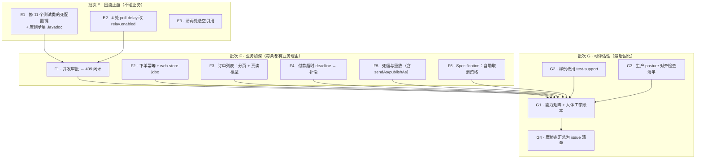
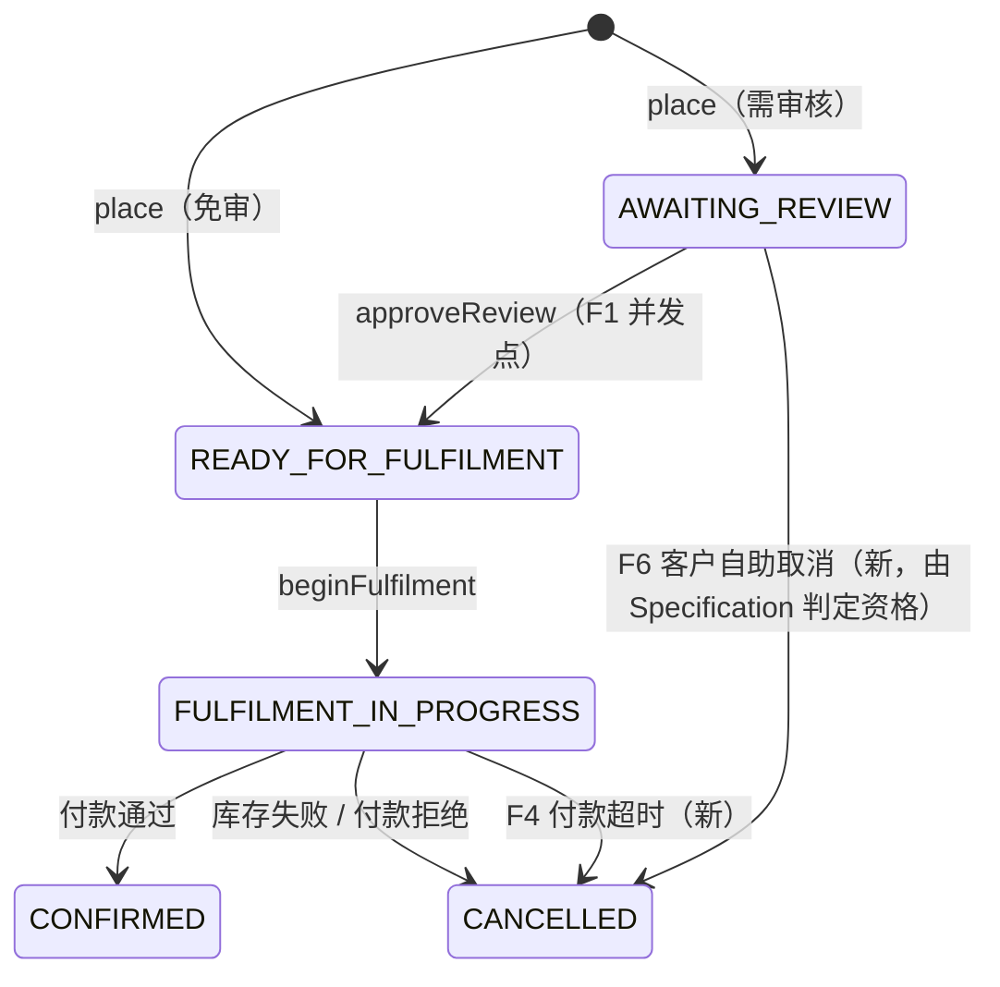

# 脚手架：把回流缺口补上，并让它能被用来"评估组件好不好用"

[[report-00001-ddd-framework-review]] 的三个阶段已由 [[plan-00013-phase-one-correctness-remediation]] 与
[[plan-00014-adoption-threshold-and-architecture-simplification]] 完成。本 plan 处理其后的两件事：

1. **回流缺口** —— plan-00014 收尾之后的三个破坏性修复（`e4d6596` / `3ac0084` / `64494d7`）没有回到样例，
   其中两处是可验证的实际缺陷。
2. **演示深度** —— 样例目前覆盖了库约六成的能力面，剩下四成（幂等、分页读模型、deadline、死信重放、
   `Specification`、冲突→409 闭环）**在样例里一次也没有出现**。它们不是"没写文档"，是"没有任何一行代码
   证明它们好用或不好用"。

**验收锚点**：`aipersimmon-ddd/README.md` 的能力表里，每一条"约定"与每一个"可替换的接缝"，
在样例里都能找到一处调用它的业务代码 + 一条会因它回归而变红的测试；找不到的，在本 plan 结束时
必须要么补上，要么在 README 里显式标注为"本样例不演示，原因是 X"。当前两者都做不到即未完成。

## 一、为什么是"加深"而不是"加宽"

一个直觉是"演示得更全面 ⇒ 再加一个限界上下文"。**这个方向应当被否决**：

- 现有三个上下文（ordering / inventory / payment）已经覆盖了 DDD 的全部结构性概念——聚合、不变式、
  策略、领域事件 vs 集成事件、ACL、流程管理器、补偿。第四个上下文只会重复它们，同时把构建时间和
  README 长度再推高一截。
- **缺的每一条能力，在现有这条订单业务线上都有天然落点**，不需要发明新业务：

  | 缺失能力 | 现有业务里的天然落点 |
  | --- | --- |
  | Web 幂等 | `POST /orders` 用户重复点击 |
  | 分页 + 真读模型 | `GET /orders?customerId=…` 客户看自己的订单 |
  | 冲突 → 409 | 两个运营同时批同一张待审订单 |
  | Deadline | 付款迟迟不回：超时 → 释放库存 → 取消（复用已有补偿路径） |
  | 死信 + 重放 | 库存服务不可达时的投递失败，与运维的重放动作 |
  | `Specification` | 客户能否自助取消（与 `Invariant` 的"违反即抛"正好对照） |

- 加宽会稀释样例的可读性，加深不会：同一条订单生命周期上多几个真实动作，读者的心智模型不变。

因此本 plan 的铁律 1 是**不新增限界上下文**。

## 二、"可评估"是本 plan 的一等产出，不是副产品

期望是"让人能评估当前这套 DDD 组件是否方便可用"。"能跑通"回答不了这个问题——需要一个可比较的量。
本 plan 要求每条新增能力落地后，在样例 README 里记一行**人体工学账本**：

| 能力 | 使用方写了几行 | 引入几个新概念 | 有没有"必须记住的顺序/搭配" | 摩擦点 |
| --- | --- | --- | --- | --- |
| （逐条填） | | | | 记为 issue 或"无" |

"必须记住的顺序/搭配"这一列是关键——report-00001 的 P1-1 之所以被判为最大采纳阻碍，正是因为
"要预先知道 `-cqrs-spring` 和 `-events-spring` 是两件事"这类隐性知识。捆绑包消掉了依赖数量，
但没有消掉这类知识；只有真的去用一次才知道还剩多少。

已经可以预见的第一个摩擦点，写在这里以免被遗忘：**`DeadLetterStore` 只有 `store` / `replay`，
没有任何查询能力**（`aipersimmon-ddd-outbox/.../DeadLetterStore.java`），运维拿不到要重放的
`eventId`，只能自己写 SQL 查 `aipersimmon_dead_letter`。F5 会撞上它——按铁律 3，立 issue，不在本 plan 里改库。

## 三、Design

E1/E2/E3 互不依赖，可并行；F1–F6 互不依赖，可并行（各自只碰自己那条业务线的文件），但都必须在
批次 E 之后起步——E1/E2 之前，任何新测试都会继承同一套失效的调度配置。G1 必须最后写，
因为账本是 F 的函数。

### 业务侧的增量（只在现有三个上下文内）

新增的只有两条转移（F4 超时、F6 自助取消）和一个读侧端点（F3），聚合的状态集合不变。

## 四、任务

> 约定：`[scaffold]` / `[process-manager-engine]` 标模块；每个任务 test-first；
> 每个任务结束跑 `mvn -f aipersimmon-ddd-scaffold/multi-module/pom.xml verify`。

### 批次 E · 回流止血

- **E1** `[process-manager-engine]`+`[scaffold]` 改正 `ProcessManagerProperties.java:10` 的 Javadoc
  （去掉 `.jdbc`，与 `:13` 的 `prefix=` 一致）；11 个测试类的 22 行属性去掉 `jdbc.` 段。
  **测**：新增 `ProcessManagerPropertyBindingTest`，断言文档所述前缀真的绑定（设 1h 得 1h，而不是默认 500ms）。
  → [[issue-00060-scaffold-tests-set-a-process-manager-prefix-that-does-not-bind]]
- **E2** `[scaffold]` 4 处 `outbox.poll-delay-ms=3600000` → `outbox.relay.enabled=false`；
  同样把只求"安静"的 `effect-relay` / `deadline-worker` 改为 `enabled=false`（真要跑快的 e2e
  保留 `poll-delay=200ms`——那是节奏诉求，用节奏参数是对的）。
  **测**：断言 `relay.enabled=false` 时上下文无 `OutboxRelayScheduler` bean，而仅设 `poll-delay-ms` 时它仍在——
  把"delay 不是开关"从注释变成断言。**另**：全仓 grep `poll-delay-ms=3600000` 0 命中。
  → [[issue-00061-scaffold-tests-disable-the-outbox-relay-with-the-wrong-lever]]
- **E3** `[scaffold]` 清两处悬空引用：`FindOrderHandler.java:14` 指向的 "CQRS read-model how-to" 已随
  `605fab3` 删除（F3 落地后这句改为指向新的读模型实现）；`OrderFulfilmentDefinition.java:31` 的
  "the old orchestration saga" 在 saga 模块删除后只对读过历史的人有意义。

### 批次 F · 业务加深

- **F1** `[scaffold]` **并发审批 → 409 闭环**。两个运营同时 `POST /orders/{id}/approve-review`：
  恰好一方 204，另一方 409，且 body 是 `/problems/resource-conflict` 的 RFC 9457 文档。
  这条链路（`OptimisticLockingFailureException` → `ConcurrencyTranslationCommandInterceptor` →
  `ConcurrencyConflictException` → `ApplicationExceptionAdvice` → 409）今天在库里逐段有测试，
  **在样例里没有一处端到端走通**——[[plan-00013-phase-one-correctness-remediation]] 的阶段验收第 3 条
  因此实际未闭合。
  **测**：`ConcurrentApprovalTest`（MockMvc + 真 PG），断言状态码分布恰好 {204, 409}、409 的
  `type`/`status` 正确、且订单最终只有一次 `OrderReadyForFulfilmentEvent`。
- **F2** `[scaffold]` **下单幂等**。`POST /orders` 打开 `aipersimmon.ddd.web.idempotency`，加
  `aipersimmon-ddd-web-store-jdbc`，`flyway.components` 补 `web-store`。
  **测**：同一 `Idempotency-Key` 重复提交返回同一 `201 + Location`，且 `ordering.orders` 只有一行、
  outbox 只有一条 `OrderReadyForFulfilment`；`allow-in-memory-stores=false` 而无 store 模块时启动失败
  （P1-6 的显式降级在样例里第一次被真的用上）。
  **评估点**：MyBatis-Plus 栈的应用必须引入一个 `-jdbc` 后缀的模块才有 web store
  （没有 `-web-store-mybatis-plus`）——这是否构成认知负担，记进账本；若构成，立 issue。
- **F3** `[scaffold]` **订单列表：分页 + 真读模型**。`GET /orders?customerId=&cursor=&size=` 返回
  `Slice<OrderListItem>`（游标分页，`Cursor` 由 `CursorJacksonModule` 序列化）。查询**不经过聚合**：
  在 `ordering-infrastructure` 写一个直接投影的 mapper，`@ReadModel` 标注返回类型。
  这同时填掉三个空白：`Page`/`Slice`/`Cursor`（C4 下沉后零示例）、真读模型（今天 `FindOrderHandler`
  直接读聚合）、以及 E3 那条悬空注释的落点。
  **测**：分页边界（首页/末页/空集）、游标不可伪造、租户隔离对读侧同样生效。
- **F4** `[scaffold]` **付款超时**。流程进入等待付款时 `ScheduleDeadline`（可配的短超时），
  超时输入落到 `OrderFulfilmentDefinition.react` 的一个新分支：走**已有的**"释放库存 → 取消订单"
  补偿路径，不新增补偿逻辑。同时把 `instance.max-lifetime` 兜底真正打开。
  这消掉样例 README "Known demo gaps" 里的那一条，也让流程管理器第一次演示它最被需要的能力。
  **测**：`PaymentTimeoutFlowTest`——付款方不回应，断言库存被释放、订单 `CANCELLED`、
  流程 `ProcessOutcome` 正确；以及一条"付款在超时后才到达"的乱序用例，断言 `ignore` 语义生效
  （不产生第二次取消）。
- **F5** `[scaffold]` **死信与重放**。用一个可开关的"必定失败"的 `OutboxDispatcher` 装饰器把一条
  集成事件打进 `aipersimmon_dead_letter`，然后由一个运维端点 `POST /ops/dead-letters/{eventId}/replay`
  调 `DeadLetterStore.replay` 让它重新投递；重放路径用 `publishAs` / `sendAs` 保持原消息身份，
  证明"重放是幂等的"而不是"又发了一条新事件"（README 把这对入口列为必须知道的约定，样例至今零使用）。
  **测**：失败 → 死信行存在 → 重放 → 消费侧只处理一次（inbox 去重生效，键为
  `(consumer, source, message_key)`，即 `3ac0084` 之后的语义）。
  **评估点**：`DeadLetterStore` 无查询 API，端点只能自己写 SQL 找 id ——立 issue，不在本 plan 修。
- **F6** `[scaffold]` **`Specification` 落地**。客户自助取消资格（"未进入 fulfilment 且下单未超 N 分钟"）
  写成可组合的 `Specification<Order>`，由应用层询问；`Invariant` 保持原样负责"违反即抛"。
  README 的"约定"一节把两者并列，样例必须两者都有，否则读者无从判断该用哪个。
  **测**：规格的组合律（and/or/not）单测 + 一条"不满足资格 → 409/422 而不是抛异常穿透"的端到端用例。

### 批次 G · 可评估性

- **G1** `[scaffold]` 扩写 README 的"能力 → 示例 → 验证测试"表，覆盖 F1–F6；新增**人体工学账本**表
  （见 §二）。对本 plan 明确不演示的能力（JDBC 栈、Redis web store、第二种拓扑），在 README 里
  单列一节写明"不演示 + 原因"，让缺席也是一个可见的决定。
- **G2** `[scaffold]` 用 `aipersimmon-ddd-test-support` 替换手写的 `TestInfrastructure`。
  CHOOSING-MODULES.md 把它列为推荐，旗舰样例却自己手搓——这既是不吃狗粮，也让容器复用的收益无从验证。
  **测**：全量测试保持绿，且容器数量下降（记录改前/改后的 `verify` 墙钟时间进账本）。
- **G3** `[scaffold]` `application.yml` 对齐 CONFIGURATION.md 的生产检查清单 7 条：补
  `web.allow-in-memory-stores`、`outbox.cleanup.enabled`（连同它的取舍注释）、`inbox.consumer`。
  样例的 yml 是使用者第二个抄的东西（第一个是 pom），它现在只示范了 7 条里的 3 条。
- **G4** `[scaffold]`+`[docs]` 把 F 全程遇到的摩擦点整理成 issue 清单，逐条链接进本 plan 的完成记录。
  这一步是 §二那个目标的交付物：**"组件好不好用"的答案就是这张清单的长度和严重度**。

## 五、铁律

1. **不新增限界上下文**。加深不加宽（理由见 §一）。
2. **每条新增能力三件套齐全**：一个业务理由（能一句话说清用户为什么要它）、一条会因该能力回归而变红的
   测试、README 表格里的一行。三缺一则该任务未完成。
3. **不改库的公开 API**。发现库缺陷 → 立 issue（AGENTS.md §7），不在本 plan 里顺手修。
   唯一例外是 E1 的那行 Javadoc——它是样例错误的根因，且不改动任何行为。
4. **本轮明确排除**：archetype 生成纳入 CI、JDBC 栈参考实现。两者都不因"顺手"而被带进来。
5. **可读性优先于覆盖率**。任何一条演示若需要超过约 80 行才能说清，改为在 README 里写指引，
   而不是把代码塞进样例——样例的价值来自能被读完（report-00001 的 P1-4 是这条的反面教材）。
6. **不放宽任何现有门禁**。样例的 Spotless / PMD+CPD / SpotBugs / domain 层 JaCoCo+PIT 一律照旧
   （`CODE_QUALITY.md`）。

## 六、验收路径

**逐任务验收**：每个任务的 `测` 项全绿，且
`mvn -f aipersimmon-ddd-scaffold/multi-module/pom.xml verify` 通过（E1 另需
`mvn -f aipersimmon-ddd/pom.xml install` 全绿）。

**阶段验收**（缺一不可）：

1. **回流缺口清零**：全仓**代码**（`--include=*.java`）grep `process-manager.jdbc.` 0 命中，
   `poll-delay-ms=3600000` 仅剩守卫测试里那一处反例；两条新增的绑定/语义守卫测试绿。
   （文档侧 issue-00060 / issue-00061 引用这两个字符串作为反例，属预期。）
2. **冲突链路端到端闭合**：存在一条从并发 HTTP 请求到 409 problem 文档的、被测试覆盖的真实路径
   ——补上 plan-00013 阶段验收第 3 条在样例侧的缺口。
3. **README 的每条约定都有代码**：`aipersimmon-ddd/README.md` 的"约定"与"可替换的接缝"两节，
   逐条在样例里能指到实现与测试；不演示的在样例 README 单列并写明原因。
4. **人体工学账本存在且填满**：F1–F6 每条都有行数 / 概念数 / 隐性搭配 / 摩擦点四列。
5. **生产检查清单 7/7 可见**：`application.yml` 对 7 条各有一处显式设置或一句显式取舍注释。
6. **既有行为无回归**：批次 E 之前已存在的 314 项测试**一行不改**仍绿（这是"加深没有改变原有语义"的证明）；
   多租户、并发超卖、outbox 原子性三条既有验收保持绿。
7. **CI 绿**：`.github/workflows/ci.yml` 的库 install + 样例 verify 两步通过。
8. **文档闭环**：issue-00060 / issue-00061 转 `resolved` 并填"验证结果"；G4 的摩擦点 issue 全部
   建立且状态正确；本 plan 转 `resolved` 并记录偏差。

**提交切分**（每批一个逻辑变更，见 `COMMIT.md`）：
`docs` (本批文档) → `fix(scaffold)` E1 → `fix(scaffold)` E2 → `docs(scaffold)` E3 →
`test(scaffold)` F1 → `feat(scaffold)` F2 → `feat(scaffold)` F3 → `feat(scaffold)` F4 →
`feat(scaffold)` F5 → `feat(scaffold)` F6 → `refactor(scaffold)` G2 → `docs(scaffold)` G1+G3 → `docs` G4。

## 关联

- [[report-00001-ddd-framework-review]]（本 plan 的来源；P1-4 / P1-6 / P2-4 在样例侧的落地缺口）
- [[plan-00013-phase-one-correctness-remediation]]（其阶段验收第 3 条由 F1 补齐）
- [[plan-00014-adoption-threshold-and-architecture-simplification]]（其后的三个修复由批次 E 回流）
- [[issue-00060-scaffold-tests-set-a-process-manager-prefix-that-does-not-bind]] ·
  [[issue-00061-scaffold-tests-disable-the-outbox-relay-with-the-wrong-lever]]
- [[issue-00059-outbox-relay-tests-race-the-startup-poll]]（E2 是它未覆盖到的第二处副本）
- [[issue-00058-in-memory-web-stores-are-a-silent-multi-instance-trap]]（F2 第一次在样例里用上它的显式降级）
